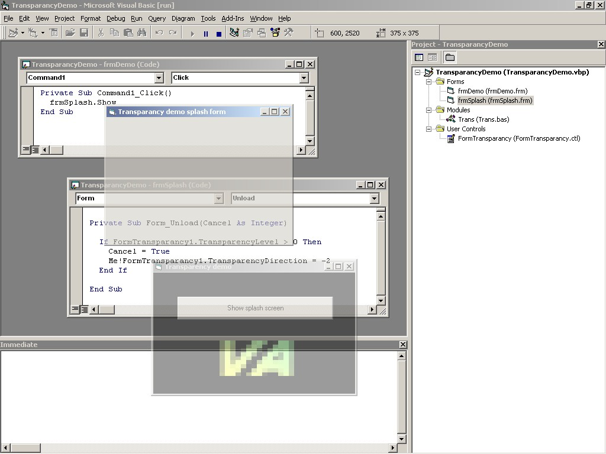



## Transparant Forms animation  \(Win2K\)

### Description

You can make your forms transparant by adding this control to your form. You can set the transparancy level and you can fade in and fade out your forms with very litle coding (All the code you need is in the screen sample).   

Be aware that the transparancy will only work on Windows 2000. If you run the code on an other version, then you will just see the forms without transparancy.  

Yes, I have used the transparancy code that was published by others. Here is the reference for this:

When i saw the code <A HREF=http://www.planet-source-code.com/vb/scripts/ShowCode.asp?lngWId=1&txtCodeId=21385>21385</A> from faisal arif, i wanted to reproduce that. After a search on planet source code on transparancy i found a working sample <A HREF=http://www.planet-source-code.com/xq/ASP/txtCodeId.8015/lngWId.1/qx/vb/scripts/ShowCode.htm>8015</A> from J.-A. Mock. I used this code as a base to crate the control. According to Reland Kluit this code is a 'stolen' copy of his code

<A HREF=http://www.planet-source-code.com/xq/ASP/txtCodeId.6546/lngWId.1/qx/vb/scripts/ShowCode.htm>6546</A>
 
### More Info
 
This code will only work on Windows 2000!

             |
---                |---
**Submitted On**   |2001-03-02 19:02:58
**By**             |[Edwin Vermeer\.](https://github.com/Planet-Source-Code/PSCIndex/blob/master/ByAuthor/edwin-vermeer.md)
**Level**          |Beginner
**User Rating**    |4.0 (20 globes from 5 users)
**Compatibility**  |VB 6\.0
**Category**       |[Custom Controls/ Forms/  Menus](https://github.com/Planet-Source-Code/PSCIndex/blob/master/ByCategory/custom-controls-forms-menus__1-4.md)
**World**          |[Visual Basic](https://github.com/Planet-Source-Code/PSCIndex/blob/master/ByWorld/visual-basic.md)
**Archive File**   |[CODE\_UPLOAD15717322001\.zip](https://github.com/Planet-Source-Code/edwin-vermeer-transparant-forms-animation-win2k__1-21447/archive/master.zip)

